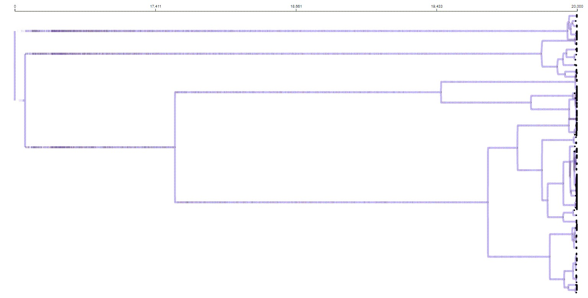

# phylogenetic-diversity-in-EC-GECCO-2022
This repository contains all code and supplimental material for "Untangling phylogenetic diversity's role in evolutionary computation using a suite of diagnostic fitness landscapes" which was presented at <a href="https://gecco-2022.sigevo.org/HomePage">The Genetic and Evolutionary Computation Conference</a>, 2022. 

<a href="https://zenodo.org/badge/latestdoi/486358143"></a>

  **Contents:**
  - [Abstract](https://github.com/shakiba-shb/phylogenetic-diversity-in-EC-GECCO-2022#abstract)
  - [Supplemental information]()
  - [Dependencies](https://github.com/shakiba-shb/phylogenetic-diversity-in-EC-GECCO-2022#dependencies)
  - [Compilation](https://github.com/shakiba-shb/phylogenetic-diversity-in-EC-GECCO-2022#compilation)
  - [Authors](https://github.com/shakiba-shb/phylogenetic-diversity-in-EC-GECCO-2022#authors)
  - [Research overview](https://github.com/shakiba-shb/phylogenetic-diversity-in-EC-GECCO-2022#research-overview)

## Abstract
Diversity is associated with success in evolutionary algorithms. To date, diversity in evolutionary computation research has mostly been measured by counting the number of distinct candidate solutions in the population at a given time point. Here, we aim to investigate the value of phylogenetic diversity, which takes into account the evolutionary history of a population. To understand how informative phylogenetic diversity is, we run experiments on a set of diagnostic fitness landscapes under a range of different selection schemes. We find that phylogenetic diversity can be more predictive of future success than traditional diversity metrics under some conditions, particularly for fitness landscapes with a single, challenging-to-find global optimum. 

## Supplemental information
The supplimental information for this paper can be found here. 

## Dependencies
To run these experiments, the Modular Agent Based Evolver [MABE2](https://github.com/mercere99/MABE2) is required. MABE2 is a software framework that can build a wide variety of computational evolution scenarios and is designed to facilitate easy re-combination of common components such as fitness functions, selection schemes, populations, and so on.

## Compilation
To complie and run the code used in this paper, take the following steps:

```{bash, shell_installation}
# Clone MABE2
git clone --recursive https://github.com/shakiba-shb/MABE2.git

# Clone the repo for this project
git clone --recursive https://github.com/shakiba-shb/phylogenetic-diversity-in-EC-GECCO-2022.git

# Compile MABE2
cd MABE2/build
make

# Tell MABE which configeration file to run
cd build
./MABE -f ../settings/configuration.mabe

# To set parameters, use command line flags
# e.g. to set the selection scheme, run --set selection_type = 0
# or to set the diagnostic suite, run --set diagnostic = 1

```
## Authors
- [Shakiba Shahbandegan](https://github.com/shakiba-shb)
- [Jose Guadalupe Hernandez](https://jgh9094.github.io/)
- [Alexander Lalejini](https://lalejini.com/)
- [Emily Dolson](http://emilyldolson.com/)

## Research overview
This paper focuses on phylogenetic diversity, which unlike common meathos of measuring diversity in a population, takes into account the evolutionary history of a population. Measuring phylogenetic diversity involves quantifying the topology of a phylogenetic tree. the following figure is an example of a phylogeny tree. Each node in the tree is a distinct phenotype with a unique evolutionary origin. The leaf nodes show the individuals in the current population (extant taxa). 



In this paper, we use a phylogenetic metric called "mean pairwise distance". To calculate pairwise distance, we count the number of edges in the shortest path between each pair of extant taxa.
The main goal of this research is to find out how informative phylogenetic diversity is. For this purpose, we compare phylogenetic diversity with phynotypic diversity. Phenotypic diversity measures the diversity of phenotypes in the population at any one point in time. We use the transfer entropy metric. More specifically, we measure the transfer entropy from phylogenetic diversity to fitness as well as from phenotypic diversity to fitness. We perform these calculations with lags ranging from 10 to 10000 generations.

## Study Design

To investigate how informative phylogenetic diversity is in evolutionary computation, we used a set of diagnostic suites which are designed to test the abilities of an evolutionary algorithm under a set of well-understood conditions. These diagnostics are:
- exploitation rate diagnostic
- ordered explotation diagnostic
- multi-path exploration diagnostic
- antagonistic contradictory objectives diagnostic
- contradictory objectives diagnostic
We ran 3 selections schemes (tournament, lexicase, epsilon lexicase) on these diagnostics and gathered a large amount of data, including some phylogenetic diversity metrics. We specifically use the "mean pairwise distance" metric in this paper and compare it with phynotypic richness. 

## Results

- Phylogenetic diversity is more informative than phenotypic diversity on landscapes with a single global optimum, in the lexicase and epsilon lexicase selection schemes. 
- Phylogenetic diversity was uninformative in the context of tournament selection.
- The difference between transfer entropy in phylogenetic and phenotypic diversity is the largest at a lag of 1000.
- Evolutionary time scale strongly influences transfer entropy.

## Future research

- Phylogenetic diversity and phenotypic diversity are both broad classes of metrics, and their variations in different contexts can be investigated further. 
- Understanding the role of evolutionary time scale in transfer entropy is an important direction for future research. 

